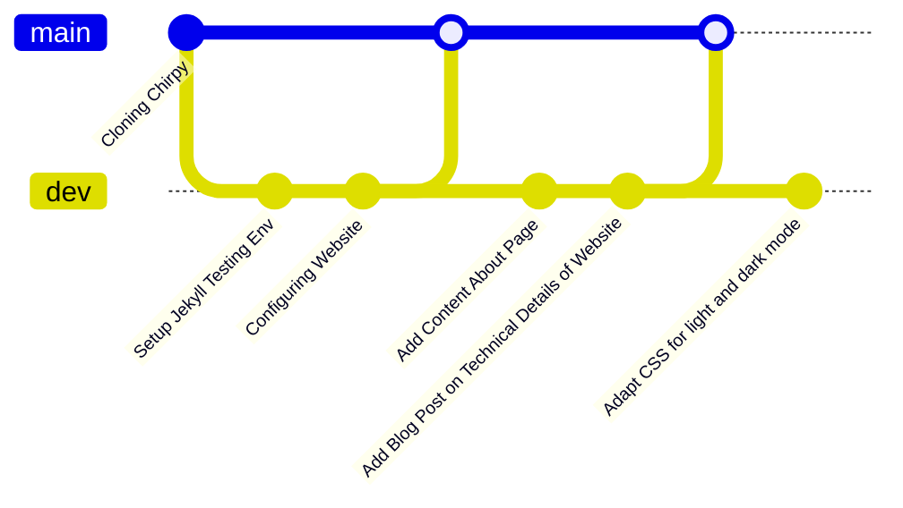

Upon visiting my website, I hope you were delighted by its design, simplicity, and delivery of content. This post is for you if you would like to get a glimpse of the technical concepts I use to develop and maintain this website.

## Requirements

Before starting off the implementation of the website, I had in mind clear non-functional requirements which this project must meet:

* Since 'the prevention of re-inventing the wheel' is a key challenge every developer ought to tackle in his daily life, the website must be based on a reusable, open, and well-maintained framework.
* The website should be developed and maintained using some sort of `Git` flow, where the `dev` environment closely follows the `prod` environment. Moreover, the `dev` environment provides comprehensive testing capabilities.
* The website should allow for creating visualisations programmatically; that is to say visualisations should, whenever possible, be based on code instead of powerpoint screenshots.
* Web hosting should be easy-to-use and inexpensive.
* Since I am travelling and I don't have my laptop with me, all of the above can be done from an iPad (yikes).

Needless to say, doing codework from an iPad is pretty uncommon... unheard of in my case: I have never met anyone before who has used an iPad to do proper development on an iPad. However, this challenge made me go out of my >5 years MacBook-based developer comfort zone, and I am really happy with the new tools and technologies I have learned thanks to my current situation.

## The Machine Room

* All codework is done from `GitHub`'s built-in [`Codespaces`](https://github.com/features/codespaces) service, representing a remote version of `Microsoft`'s `Visual Studio Code`. This way, all technical work is seamlessly integrated in the `Git` flow I have defined for this project, namely a `main` branch (this is the website you see) and a `dev` branch (where the website gets fully developed and tested prior to release).

* Just like `Visual Studio Code`, `Codespaces` comes with a `Terminal` which allows for building and testing the website in its `dev` stage. This is super important in my case since iPads do not feature anything like a `Terminal`, which is why I need to use an IDE covering all aspects of development and testing.
* To host my personal website **at no cost**, I am using [`GitHub Pages`](https://pages.github.com), which automatically builds a website from this repo using GitHub's open-sourced [Jekyll](https://jekyllrb.com) framework. Jekyll allows for creating content using both `.md` markdown files as well as `HTML-CSS-JS`, thereby allowing content with different degrees of complexity.
* Instead of building a website from scratch, I wanted to leverage an existing `Jekyll` template in order for spending the majority of my time on content creation and website personalisation, thereby preventing the typical as well as tempting IT-pitfall of re-inventing the wheel and tackling problems which have already been solved. Here, I am using the [`Chirpy`](https://github.com/cotes2020/jekyll-theme-chirpy) template, which gives me a neat basic setup of a personal website and which allows me to add various content in the form of blog posts. Moreover, `Jekyll` features the [`mermaid.js`](https://mermaid.js.org) library which allows me to create common visualisations in `markdown` syntax, where I can still create additional visualisations using JS charting libraries such as [`chart.js`](https://www.chartjs.org).

## Summary

In short, this website uses GitHub's built-in features for development, testing, and hosting. Please note that there are a raft of options for creating your own website, ranging from a [Joomla](https://www.joomla.org)-based CMS to an [Angular](https://angular.io)-based website hosted in a container environment, where your actual implementation should accomodate the needs you are facing.